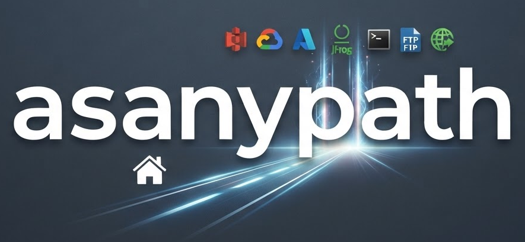

©2026 Axis Communications AB. AXIS COMMUNICATIONS, AXIS, ARTPEC and VAPIX are registered trademarks of Axis AB in various jurisdictions. All other trademarks are the property of their respective owners.

<p align="left">
  
</p>

AsAnyPath gives Python applications one asynchronous, pathlib-inspired API for
local files and cloud object storage. Use it when an application must copy,
read, list, or synchronize data without coupling its business logic to a single
storage provider.

The same code works with local disk, Amazon S3, Google Cloud Storage, Azure
Blob Storage, Artifactory, ssh, ftp, ftps, and plain HTTP(S). Typical uses include moving data
between cloud providers, writing backup tools, and testing storage workflows
locally before connecting to a cloud account.

## Requirements

- Python 3.10 through 3.14.
- Access credentials for each cloud service that your application uses.
- A POSIX-compatible shell such as Bash or Zsh for the terminal commands below.
    Windows users can use Windows Subsystem for Linux or adapt the commands for
    PowerShell.
- Rust and a supported C compiler only when building the native extension from
    source. Published package wheels do not require a local Rust toolchain.

## Usage

```python
from asanypath import AsAnyPath

# The same API works for every backend — just change the URI scheme
path = AsAnyPath("s3://bucket/data.parquet")  # or gs://, az://, art://, file://, /local/path

data = await path.read_bytes()
await path.write_bytes(b"new content")
exists = await path.exists()
info = await path.stat()

# Iterate directories
async for child in path.parent.iterdir():
    print(child.name)

# Glob
async for p in AsAnyPath("s3://bucket/logs/").glob("**/*.json"):
    print(p)

# Walk (like os.walk)
async for root, dirs, files in AsAnyPath("az://container/prefix").walk():
    for f in files:
        print(root / f)

# Presigned URLs (S3, GCS, Azure)
url = await path.presign(expires=3600, method="GET")
```

### File-like open (lazy range reads)

```python
# Binary streaming — only fetches the bytes you read (no full download)
async with path.open("rb") as f:
    header = f.read(64)

# Text mode with custom buffer size (controls prefetch chunk)
async with path.open("r", buffering=2_000_000) as f:
    first_line = f.readline()

# Sync works too
with path.open("rb") as f:
    f.seek(1024)
    chunk = f.read(512)
```

Files smaller than the buffer size are fetched in one shot automatically.
Supported on S3, GCS, Azure, and Artifactory.

### Copy and recursive delete

```python
# Copy a single file (cross-backend supported)
await src.copy(dst)

# Copy entire directory tree
await src.copy(dst, recursive=True)

# Remove directory and all its contents
await path.rmdir(recursive=True)
```

For synchronous code (no `await` needed):

```python
from asanypath.sync import AsAnyPath

p = AsAnyPath("s3://bucket/data.parquet")
data = p.read_bytes()  # blocks until complete
p.write_bytes(b"new content")

for child in p.parent.iterdir():  # yields synchronously
    print(child.name)
```

Local paths (`file://` or bare `/path`) bypass the proxy entirely and use
`pathlib.Path` directly — zero threading overhead.

Unknown URI schemes now construct as `UnsupportedProtocolPath` placeholders.
Pure path operations (e.g. `.name`, `.parent`, joins) still work, while backend
operations (e.g. `.exists()`, `.read_bytes()`, `.open()`) raise
`UnsupportedProtocolError` on use.

## Installation

Most cloud backends (S3, GCS, Azure, Artifactory, HTTP) are included in the base
install — no per-backend extras needed.

The following commands install from a checked-out source repository in a
POSIX-compatible shell. Public package-install instructions will be added when
the PyPI distributions are published.

```bash
# Core development environment (includes the most common cloud backends)
uv sync

# With CLI
uv sync --extra cli

# With SSH, FTP backend support
uv sync --extra ssh --extra ftp

# With OS keyring-backed credential cache
uv sync --extra credstore

# With benchmark dependencies
uv sync --extra bench

# Full install all cloud backends
uv sync --extra all
```


### Cloud Backend Status

| Backend | Status | Authentication | Operations |
|---------|--------|----------------|-----------|
| Local FS | ✅ Full | N/A | All async pathlib methods |
| S3 | ✅ Full | AWS credentials / SigV4 | read/write/list/delete/stat/checksums/presign |
| GCS | ✅ Full | Service account / token | read/write/list/delete/stat/checksums/presign |
| Azure | ✅ Full | Account key / SAS token | read/write/list/delete/stat/checksums/presign |
| Artifactory | ✅ Full | Bearer token | read/write/list/delete/stat/checksums |
| HTTP(S) | ✅ Full | N/A | read (GET) |

## CLI Usage

```bash
# Install with CLI support
uv sync --extra cli

# List supported protocols
asanypath protocols

# Check if a file exists
asanypath exists s3://bucket/file.txt

# Print file contents
asanypath cat s3://bucket/file.txt

# List directory (Artifactory with token)
asanypath ls art://repo/path/ --token mytoken

# Copy local → cloud
asanypath cp /local/file.txt s3://bucket/file.txt

# Copy cloud → local
asanypath cp s3://bucket/file.txt /local/file.txt

# Delete a file
asanypath rm s3://bucket/file.txt --force

# Move / rename
asanypath mv s3://bucket/old.txt s3://bucket/new.txt

# Create directory
asanypath mkdir s3://bucket/new-prefix/ --parents

# File statistics
asanypath stat s3://bucket/file.txt

# Presigned URLs (S3, GCS, Azure — 1h default)
asanypath presign s3://bucket/file.txt
asanypath presign gs://bucket/file.txt --expires 7200
asanypath presign az://container/file.txt --method PUT

# Auth diagnostics
asanypath auth show

asanypath auth show s3://bucket
```

### Shell Completions (Beta)

Path completions are available for all subcommands that take cloud paths: `ls`, `cp`, `mv`, `rm`, `stat`, `cat`, `exists`, `touch`, `checksums`, `mkdir`, `presign`, and `sync`.

Completions complete cloud paths up to 50 items deep with shallow enumeration (immediate children only), and are cached for 30 seconds per prefix to avoid redundant backend requests.

**Bash Setup:**

```bash
# One-time for current shell
eval "$(asanypath completion bash)"

# Persist in ~/.bashrc
echo 'eval "$(asanypath completion bash)"' >> ~/.bashrc
```

**Zsh Setup:**

```bash
# One-time for current shell
eval "$(_ASANYPATH_COMPLETE=zsh_source asanypath)"

# Persist in ~/.zshrc
echo 'eval "$(_ASANYPATH_COMPLETE=zsh_source asanypath)"' >> ~/.zshrc
```

If you run `asanypath` from a virtual environment path, use that exact executable
in the eval command, for example:

```bash
eval "$(/path/to/venv/bin/asanypath completion bash --exe /path/to/venv/bin/asanypath)"
```

If completions still do not appear, verify and rebind in the current shell:

```bash
# Ensure shell command cache is refreshed
hash -r

# Confirm which executable is active
command -v asanypath

# Remove stale completion binding (if any)
complete -r asanypath 2>/dev/null || true

# Rebind completions against the active executable
eval "$(_ASANYPATH_COMPLETE=bash_source "$(command -v asanypath)")"

# Verify completion is registered
complete -p asanypath
```

Tip: if `asanypath` comes from a project venv, prefer putting the explicit venv path in your shell rc file instead of relying on PATH ordering.

**Usage:**

```bash
asanypath ls s3://bucket/pre[TAB]      # Completes to matching S3 prefixes
asanypath cp s3://src/fi[TAB] ./[TAB]  # Completes both source and destination
asanypath rm s3://[TAB]                # Lists buckets
```

Completion respects environment variables for cloud credentials (e.g., `AWS_ACCESS_KEY_ID`, `AWS_SECRET_ACCESS_KEY` for S3). Bearer token auth (for custom endpoints) is not supported in completions; only env var-based auth is used.

## Benchmarks

Multi-backend benchmark suite in `scripts/bench.py` compares asanypath against
fsspec, cloudpathlib, and native async SDKs. Run against live services or local
emulators (`compose.yml` provides MinIO, Azurite, and fake-gcs-server).

```bash
# Local only (no cloud creds needed)
uv run --extra bench python scripts/bench.py --backend local --rounds 3

# Single backend
uv run --extra bench python scripts/bench.py --backend s3 --rounds 5

# All backends
uv run --extra bench python scripts/bench.py --backend all --rounds 3 --objects 10

# Sweep concurrency levels
uv run --extra bench python scripts/bench.py --backend art --rounds 3 --concurrency-levels 1,10,50
```

### S3 — live S3-compatible service (median of 20 rounds, 10 objects, c=1)

| Operation | asanypath | s3fs | aiobotocore | cloudpathlib |
|-----------|-----------|------|-------------|--------------|
| write | 8.47 ms | 9.52 ms | 43.39 ms | 48.02 ms |
| read | 4.03 ms | 9.43 ms | 20.16 ms | 13.30 ms |
| exists | 3.58 ms | 4.54 ms | 20.49 ms | 4.48 ms |
| iterdir | 38.91 ms | 39.33 ms | 57.76 ms | 41.95 ms |

### Azure — Azurite emulator (median of 20 rounds, 10 objects, c=1)

| Operation | asanypath | azure-sdk | adlfs | cloudpathlib |
|-----------|-----------|-----------|-------|--------------|
| write | 1.77 ms | 1.86 ms | 1.93 ms | 8.29 ms |
| read | 0.68 ms | 1.15 ms | 2.50 ms | 3.46 ms |
| exists | 0.56 ms | 0.83 ms | 1.04 ms | 1.02 ms |
| iterdir | 1.34 ms | 2.21 ms | 4.37 ms | 2.59 ms |

### GCS — fake-gcs-server emulator (median of 20 rounds, 10 objects, c=1)

| Operation | asanypath | gcloud-aio | cloudpathlib | gcsfs |
|-----------|-----------|------------|--------------|-------|
| write | 0.22 ms | 0.24 ms | 2.88 ms | 0.33 ms |
| read | 0.12 ms | 0.14 ms | 1.34 ms | 0.19 ms |
| exists | 0.12 ms | 0.14 ms | 0.44 ms | 0.41 ms |
| iterdir | 0.20 ms | 0.16 ms | 0.55 ms | 0.24 ms |

### Artifactory — live server (median of 20 rounds, 10 objects, c=1)

| Operation | asanypath | aiohttp | requests |
|-----------|-----------|---------|----------|
| write | 39.77 ms | 38.00 ms | 36.67 ms |
| read | 4.29 ms | 4.75 ms | 5.43 ms |
| exists | 2.97 ms | 3.02 ms | 4.52 ms |
| iterdir | 4.59 ms | 4.18 ms | 6.26 ms |

### SSH / SFTP — localhost emulator (median of 20 rounds, 10 objects, c=1)

| Operation | asanypath | asyncssh |
|-----------|-----------|----------|
| write | 0.32 ms | 0.27 ms |
| read | 0.34 ms | 0.33 ms |
| exists | 0.11 ms | 0.11 ms |
| iterdir | 0.52 ms | 0.40 ms |

### FTP — localhost emulator (median of 20 rounds, 10 objects, c=1)

| Operation | asanypath | aioftp |
|-----------|-----------|--------|
| write | 0.40 ms | 0.34 ms |
| read | 0.36 ms | 0.32 ms |
| exists | 1.12 ms | 0.92 ms |
| iterdir | 1.10 ms | 0.92 ms |

Latencies are per-operation medians over 20 rounds. S3 and Artifactory ran
against live services; Azure, GCS, SSH/SFTP, and FTP against local emulators
(Azurite, fake-gcs-server, and localhost sftp/ftp), so those figures reflect
client-library overhead, not WAN latency. (A direct live-remote SSH run confirms
the tie — asanypath vs asyncssh within noise.) asanypath matches or beats
dedicated client libraries on most operations while providing a single unified
API across all backends.

## How It Works

`AsAnyPath` dispatches on the URI scheme to return the right path class:

| Protocol | Class | Transport |
|----------|-------|-----------|
| `file://` or bare path | `AsyncPath` | `anyio` / `pathlib` |
| `s3://` | `S3Path` | reqwest + SigV4 |
| `gs://`, `gcs://` | `GCSPath` | reqwest + JSON API |
| `az://`, `azure://` | `AzurePath` | reqwest + SharedKey |
| `art://` | `ArtifactoryPath` | reqwest + Bearer |
| `http://`, `https://` | `HTTPPath` / `HTTPSPath` | reqwest |

All network I/O is handled by `asanypath-native` (Rust/PyO3 + reqwest) with
jittered exponential backoff retry for transient errors.

## API Reference

### `AsAnyPath(path, **kwargs)`

Factory that returns the appropriate path instance based on the URI scheme.

### Async Methods

All path implementations support:

- `open(mode, buffering)` — file-like streaming with lazy range reads
- `copy(dst, recursive)` — copy file or tree (cross-backend)
- `read_bytes()` / `write_bytes(data)`
- `read_text(encoding)` / `write_text(data, encoding)`
- `exists()` / `is_file()` / `is_dir()`
- `stat()` / `checksums()` (cloud backends)
- `mkdir(parents, exist_ok)` / `touch(exist_ok)`
- `unlink(missing_ok)` / `rmdir(recursive)`
- `iterdir()` / `rename(target)`
- `get_access_policy()` / `update_access_policy(policy_patch)`

### Backend Operation Options

Operations which make provider requests accept a keyword-only `backend_options`
value for provider-native configuration. Options are attached to one operation,
not to the path or its credentials, and remain distinct when uploads are
batched. `copy()`, `move()`, `rename()`, and `replace()` use
`destination_backend_options` because they configure the destination request.

```python
from asanypath import BackendOptions, S3Path

path = S3Path("s3://bucket/report.json")
await path.write_bytes(
    payload,
    backend_options=BackendOptions(
        headers={"content-type": "application/json", "x-amz-meta-source": "etl"},
        query={"x-id": "PutObject"},
    ),
)
```

`BackendOptions` has three independent mappings:

| Field | Purpose | Availability |
|---|---|---|
| `headers` | Additional HTTP request headers | S3, GCS, Azure, and Artifactory data operations |
| `query` | Additional HTTP query parameters | S3, GCS, Azure, and Artifactory data operations |
| `provider` | Structured backend-specific operation settings | GCS object-resource fields; local policy symlink behavior; Artifactory permission-target selection |

Authentication, `Host`, and `Content-Length` remain owned by asanypath. On GCS
uploads, `provider` supplies object-resource fields and selects a multipart
upload. Other data backends reject unsupported `provider` values rather than
silently dropping them. `provider` is also used by policy operations as
described below; it is not automatically forwarded as HTTP request data.

For S3 metadata replacement, provide both `x-amz-metadata-directive: REPLACE`
and the desired `x-amz-meta-*` headers. Headers and query parameters are
additive: they cannot override credentials or protocol-critical values.

### Access Policies

`get_access_policy()` returns an `AccessPolicy` with `owner`, `group`,
normalized `grants`, and a provider-native `provider` mapping. A grant
principal is backend-defined: local, SSH, and FTP paths use `owner`, `group`,
and `everyone`; object stores use provider principal strings such as
`user:reader@example.com` or `canonical-user:<id>`.

Normalized actions are `read`, `write`, and `execute`. They deliberately do
not flatten every provider-specific permission. The complete provider document
is kept in `policy.provider` so a read-modify-replace workflow does not discard
permissions, principals, or scope that lack a portable equivalent.

```python
from asanypath import AccessGrant, AccessPolicyPatch, AsyncPath

path = AsyncPath("report.txt")
await path.update_access_policy(
    AccessPolicyPatch(
        grants=(
            AccessGrant("group", frozenset({"read"})),
            AccessGrant("everyone", frozenset()),
        )
    )
)
```

For local paths, grants map to POSIX owner, group, and other mode bits;
`owner` and `group` map to ownership changes. Backend-specific controls are
passed through `BackendOptions`, for example
`BackendOptions(provider={"follow_symlinks": False})` on local paths.

| Backend | Policy scope | Read | Update |
|---|---|---|---|
| Local | Path | POSIX mode and local owner/group names | POSIX mode and ownership; `follow_symlinks` option |
| SSH/SFTP | Path | POSIX mode and numeric uid/gid | SFTP `chmod` and `chown` |
| FTP/FTPS | Path | MLST `unix.mode`, when provided by the server | `SITE CHMOD`, when supported; ownership is unavailable |
| S3 | Object | Object ACL | Complete `s3_acl` document |
| GCS | Object | Object ACL | Complete `gcs_acl` document |
| Azure Blob | Container | Public access and stored SAS policies | Complete `azure_container_acl` document |
| Artifactory | Named permission target | Target selected by `permission_target` option | Complete `artifactory_permission_target` document |

S3 and GCS normalize only their unambiguous read/write permissions. Azure
maps public blob/container access to an `everyone` read grant. These calls do
not evaluate S3 bucket policies, GCS IAM, Azure RBAC, ADLS Gen2 ACLs, or
effective access.

Cloud ACL updates require the complete native document returned by the matching
read. This makes replacement explicit and preserves fields outside the
portable policy model:

```python
from asanypath import AccessPolicyPatch, AsyncPath

path = AsyncPath("s3://bucket/report.json")
policy = await path.get_access_policy()
await path.update_access_policy(AccessPolicyPatch(provider={"s3_acl": policy.provider["s3_acl"]}))
```

Artifactory operations are target-scoped rather than artifact-scoped because a
target can cover several repositories and path patterns. Select it explicitly
for both calls:

```python
from asanypath import AccessPolicyPatch, AsyncPath, BackendOptions

path = AsyncPath("art://artifactory.example.com/artifactory/generic/report.json")
options = BackendOptions(provider={"permission_target": "release-readers"})
policy = await path.get_access_policy(backend_options=options)
await path.update_access_policy(
    AccessPolicyPatch(
        provider={"artifactory_permission_target": policy.provider["artifactory_permission_target"]}
    ),
    backend_options=options,
)
```

The remote server remains authoritative. Missing privileges, disabled ACL
features, unsupported FTP extensions, and invalid provider documents raise the
provider's normal authorization or validation error. Missing required local
policy context, such as an Artifactory permission target or complete cloud ACL
document, raises `ValueError` before a request is sent.

The remaining cloud backends raise `NotImplementedError` rather than silently
translating provider IAM or ACL models.

### Properties

- `name`, `stem`, `suffix`, `parent`, `parts`
- `protocol` — URI scheme (`s3`, `gs`, `az`, `art`, `file`, …)

## Development

Run these commands in a POSIX-compatible shell such as Bash or Zsh:

```bash
git clone https://github.com/AxisCommunications/asanypath.git
cd asanypath

# Install with dev dependencies
uv sync --extra dev

# Run tests
uv run pytest

# Build Rust native accelerator (optional)
cd rust && PYO3_USE_ABI3_FORWARD_COMPATIBILITY=1 uv tool run maturin develop --release
```

## License

[MIT](./LICENSE)
